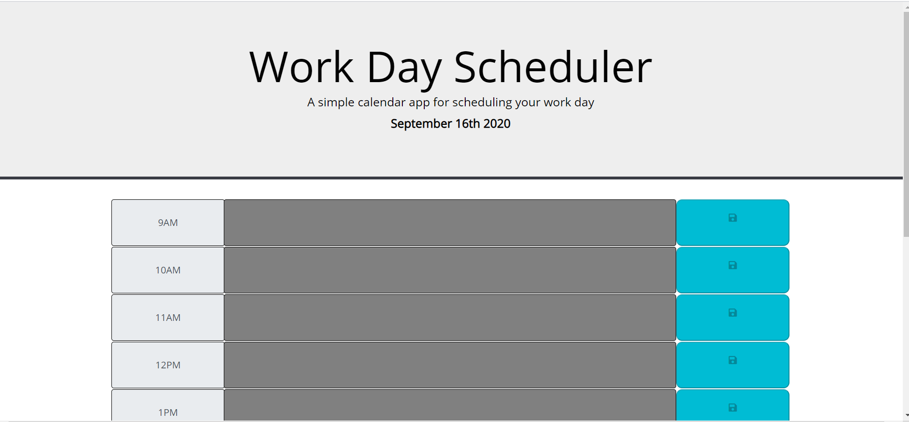
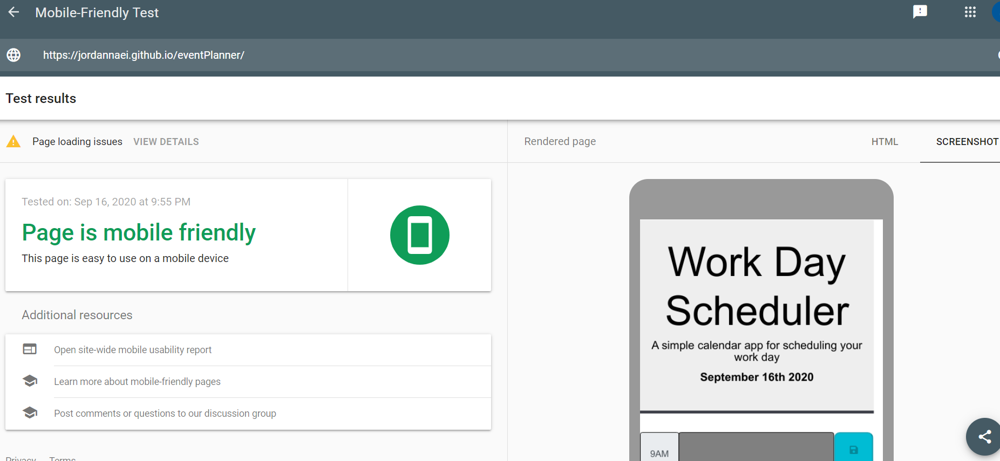
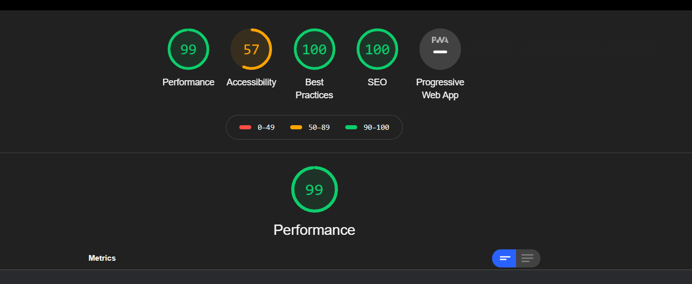

# Work Day Scheduler
```
This project aimed to build a a simple calendar application that allows the user to save events for each hour of the day. This app will run in the browser and feature dynamically updated HTML and CSS powered by jQuery.

to ensure the following:
    -	ensuring that people with disabilities can acccess the website.
    -	Prevent any possible litigations.
Our Dev team built the Website and optimized the html and css code to meet the client expectations. The list below identifies the changes and enhancement our Dev team applied to the code:
    1-	The usage of regular divs instead of other semantic html 5 elements, for simplicity.
    2-	Ensure that the html and css style guide criteria is met.
    5-	Generated report to the before and after website code base to exhibit the benefits of our enhancement in the following category:
    . Performance.
    . Best practices.
    . Accessibility.
    . SEO.
    6- Ensuured that the website is responsive enough to variety of view ports sizes.
    7- We included sceenshots of different reports to confirm the deliveriables. (Please check the word document attached).
```

## User Story

```
AS AN employee with a busy schedule
I WANT to add important events to a daily planner
SO THAT I can manage my time effectively
```

## Acceptance Criteria

```
GIVEN I am using a daily planner to create a schedule
WHEN I open the planner
THEN the current day is displayed at the top of the calendar (pass)
WHEN I scroll down
THEN I am presented with timeblocks for standard business hours (pass)
WHEN I view the timeblocks for that day
THEN each timeblock is color coded to indicate whether it is in the past, present, or future (pas)
WHEN I click into a timeblock
THEN I can enter an event (pass)
WHEN I click the save button for that timeblock
THEN the text for that event is saved in local storage (pass)
WHEN I refresh the page
THEN the saved events persist (pass)
```
###
Deployed application URL: https://jordannaei.github.io/codeQuiz/index.html


###
Mobile Friendly checker:


###
DevTool Test:

